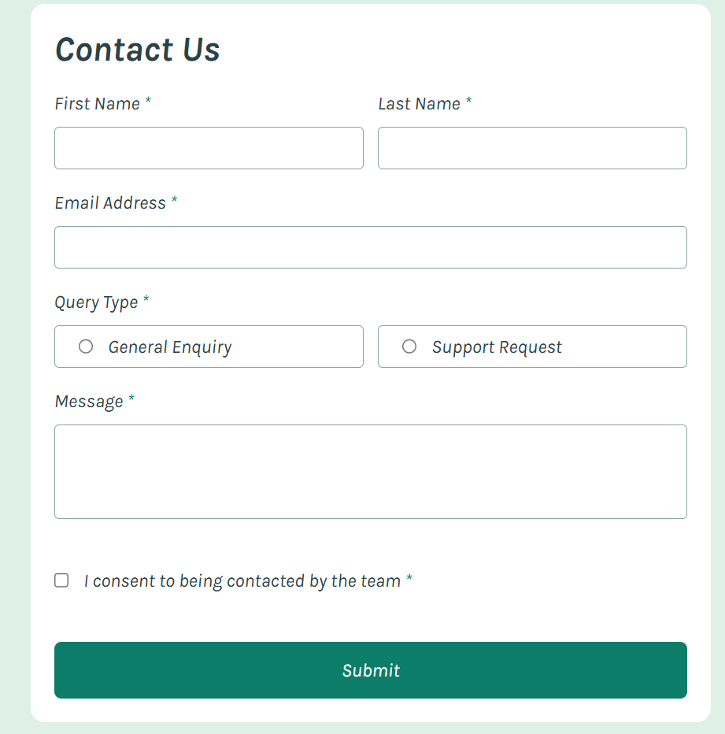

# Frontend Mentor - Contact form solution

This is a solution to the [Contact form challenge on Frontend Mentor](https://www.frontendmentor.io/challenges/contact-form--G-hYlqKJj). Frontend Mentor challenges help you improve your coding skills by building realistic projects.

## Table of contents

- [Overview](#overview)
  - [The challenge](#the-challenge)
  - [Screenshot](#screenshot)
  - [Links](#links)
- [My process](#my-process)

  - [Built with](#built-with)
  - [What I learned](#what-i-learned)

- [Author](#author)
- [Acknowledgments](#acknowledgments)

## Overview

### The challenge

Users should be able to:

- Complete the form and see a success toast message upon successful submission
- Receive form validation messages if:
  - A required field has been missed
  - The email address is not formatted correctly
- Complete the form only using their keyboard
- Have inputs, error messages, and the success message announced on their screen reader
- View the optimal layout for the interface depending on their device's screen size
- See hover and focus states for all interactive elements on the page

### Screenshot

### Links

- Live Site URL: [https://kirlosbasta.github.io/contact-form/](https://kirlosbasta.github.io/contact-form/)

## My process

### Built with

- Semantic HTML5 markup
- tailwindcss - For styles
- Flexbox
- Mobile-first workflow
- [React](https://reactjs.org/) - JS library

### What I learned

I learned how to implement form validation in React using the `useState` and `useEffect` hooks. I also practiced creating a responsive layout with Tailwind CSS, ensuring that the form looks good on both desktop and mobile devices.

I also learned how to handle form submission and display success messages using state management in React. This project helped me understand the importance of user feedback in forms, such as validation messages and success notifications.

I also implemented keyboard navigation to allow users to complete the form using only their keyboard, enhancing accessibility for all users.

## Author

- Frontend Mentor - [@kirlosbasta](https://www.frontendmentor.io/profile/kirlosbasta)
- GitHub - [@kirlosbasta](https://github.com/kirlosbasta)'d like to share.\*\*

## Acknowledgments

I would like to thank the Frontend Mentor community for providing such a great platform to practice and improve my skills. The challenges are well-designed and offer a variety of real-world scenarios that help in learning and applying new techniques.
